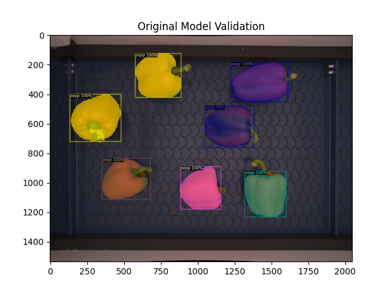
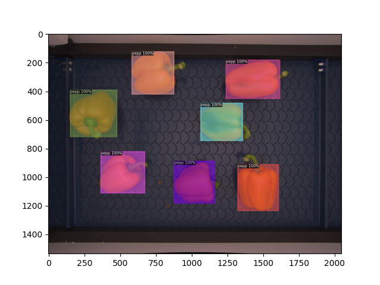
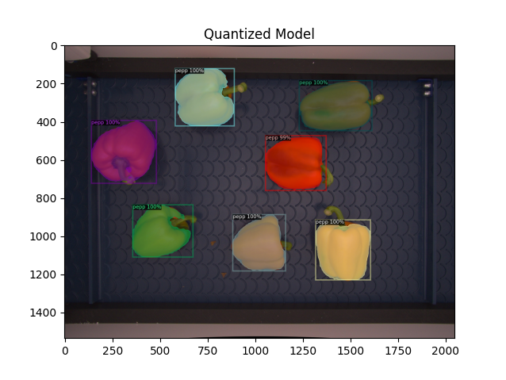
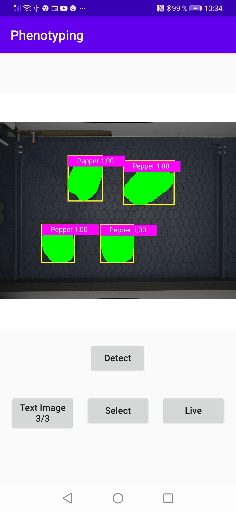
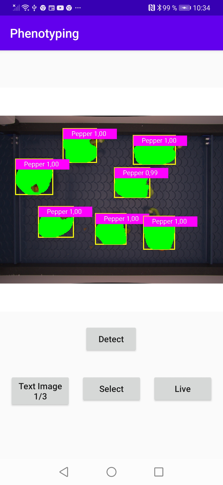

# Edge-device-deployment
## [](https://github.com/Asad-Ismail/Edge-device-deployment/issues) [](https://hits.seeyoufarm.com)

## General Pytorch Quantization Test
See quantization-pytorch for Pytorch Quantizatizationn Tests

## D2Go for Instance Segmentation
See D2Go for Instance semgementaiton on custom Vegetable dataset. 


**To Train on custom dataset run**
python veg_train_infer.py --train True

**To Validate and visualize the model**
python veg_train_infer.py --val True

**To Quantize the model**
python veg_train_infer.py --m_conversion True

Visual results on original dataset

<p align="center">
    
  </p>
  
With Post taining quantization we observe the classification and object detection works well while we suffer significat drop in accuracy of Dense Prediction (masks)

<p align="center">
    
  </p>

With Quantization Aware Pruning we see negligible drop in accuracy. The size of final quantized model is total **7.4MB**      

<p align="center">
    
  </p>


## Android App for Instance Segmentation
For Android app for instance segmentaiton using MaskRCNN we added nearest Neighbout Interpolation for Masks and Canvas visualization of masks in Java. See D2Go/android-app for android app. On **Huwawei P30** model runs at average of **140ms**

<p align="center">
  
   
</p>

### References
```
1) See  D2G0 https://github.com/facebookresearch/d2go
2) See  Android App for Pytorch https://github.com/pytorch/android-demo-app
